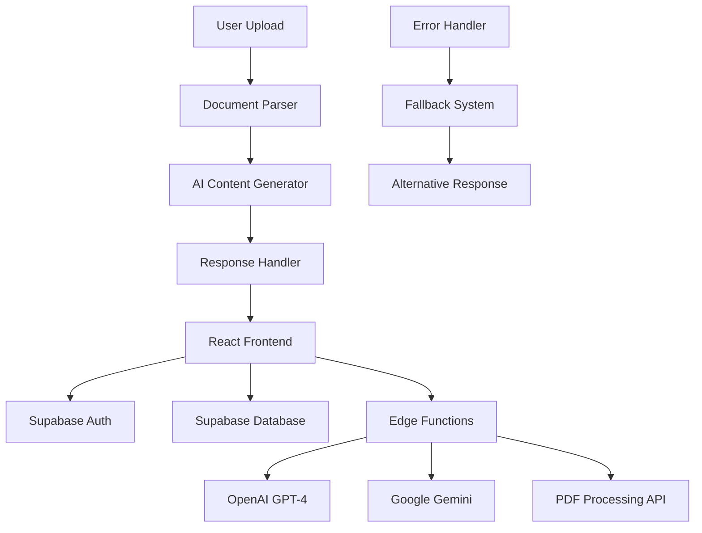

# 🎓 EduGuide AI - Final Year Project

[]()
[]()
[]()
[]()

> **An AI-powered educational assistant leveraging multiple AI models for personalized learning**

## 📋 Table of Contents

- [Project Overview](#project-overview)
- [Key Features](#key-features)
- [Technology Stack](#technology-stack)
- [Architecture](#architecture)
- [Installation](#installation)
- [Usage](#usage)
- [API Documentation](#api-documentation)
- [Contributing](#contributing)
- [Research & Academic Context](#research--academic-context)
- [License](#license)

## 🚀 Project Overview

EduGuide AI is a comprehensive educational platform that integrates multiple AI models (OpenAI GPT-4 and Google Gemini) to provide:

- **Automated Content Generation**: Practice questions, summaries, and key points from uploaded documents
- **Interactive PDF Chat**: Real-time Q&A with document content
- **Role-Based Learning**: Separate interfaces for students and teachers
- **Progress Tracking**: Comprehensive learning analytics and performance monitoring
- **Multi-Modal Support**: PDF, DOCX, PPTX document processing

### 🎯 Research Objectives

1. **Personalized Learning**: Develop AI-driven content generation tailored to individual learning needs
2. **Multi-AI Integration**: Implement robust fallback systems using multiple AI providers
3. **Educational Impact**: Measure effectiveness of AI-generated content vs traditional methods
4. **User Experience**: Create intuitive interfaces for both students and educators

## ✨ Key Features

### 🧑‍🎓 Student Features
- **Study Materials Generator**: Upload documents and generate practice questions
- **PDF Chat Interface**: Interactive Q&A with uploaded PDFs
- **Automatic Summarization**: AI-generated summaries and key points
- **Progress Tracking**: Monitor learning progress and performance
- **Study Tools**: Flashcards, timers, and review systems

### 👨‍🏫 Teacher Features
- **Content Management**: Upload and organize teaching materials
- **Student Monitoring**: Track student progress and engagement
- **Question Bank**: Access to AI-generated question repositories
- **Analytics Dashboard**: Comprehensive learning analytics

### 🤖 AI Integration
- **Multi-Model Architecture**: OpenAI GPT-4 + Google Gemini
- **Intelligent Fallbacks**: Robust error handling and alternative responses
- **Real-time Processing**: Instant content generation and feedback
- **Context Awareness**: Document-specific AI responses

## 🛠 Technology Stack

### Frontend
- **React 18** - Modern component-based UI library
- **TypeScript** - Type-safe JavaScript development
- **Vite** - Fast build tool and development server
- **Tailwind CSS** - Utility-first CSS framework
- **shadcn/ui** - High-quality component library
- **Framer Motion** - Advanced animations and interactions

### Backend & Infrastructure
- **Supabase** - Backend-as-a-Service platform
  - Authentication & Authorization
  - Real-time database
  - Edge Functions for AI processing
- **Supabase Edge Functions** - Serverless AI integration
- **PostgreSQL** - Primary database

### AI & ML Services
- **OpenAI GPT-4** - Primary content generation
- **Google Gemini** - Secondary AI provider
- **Custom PDF API** - Document processing and chat
- **Fallback Systems** - Error handling and alternatives

### Development Tools
- **ESLint** - Code linting and quality
- **Prettier** - Code formatting
- **React Query** - Data fetching and caching
- **React Router** - Client-side routing

## 🏗 Architecture



### Component Architecture
```
src/
├── components/
│   ├── auth/           # Authentication components
│   ├── features/       # Core AI features
│   ├── layout/         # Layout components
│   └── ui/             # Reusable UI components
├── context/            # React context providers
├── hooks/              # Custom React hooks
├── pages/              # Page components
├── services/           # API and service integrations
└── utils/              # Utility functions
```

## 🚀 Installation

### Prerequisites
- Node.js 18+ 
- npm or yarn
- Supabase account
- OpenAI API key
- Google Gemini API key

### Setup Instructions

1. **Clone the repository**
   ```bash
   git clone https://github.com/wajidabbas33/edu-guide.git
   cd edu-guide
   ```

2. **Install dependencies**
   ```bash
   npm install
   ```

3. **Environment Configuration**
   Create a `.env.local` file:
   ```env
   VITE_SUPABASE_URL=your_supabase_url
   VITE_SUPABASE_ANON_KEY=your_supabase_anon_key
   VITE_OPENAI_API_KEY=your_openai_key
   VITE_GEMINI_API_KEY=your_gemini_key
   ```

4. **Database Setup**
   ```bash
   # Initialize Supabase
   npx supabase init
   npx supabase start
   npx supabase db push
   ```

5. **Start Development Server**
   ```bash
   npm run dev
   ```

6. **Build for Production**
   ```bash
   npm run build
   ```

## 📖 Usage

### For Students
1. **Register/Login** with student role
2. **Upload Documents** (PDF, DOCX, PPTX)
3. **Generate Content** - Choose from:
   - Practice Questions
   - Document Summaries  
   - Key Points
   - PDF Chat
4. **Practice & Learn** with AI-generated materials
5. **Track Progress** through analytics dashboard

### For Teachers
1. **Register/Login** with teacher role
2. **Upload Course Materials**
3. **Generate Question Banks**
4. **Monitor Student Progress**
5. **Access Teaching Analytics**

### API Usage Example
```typescript
// Generate practice questions
const questions = await generatePracticeQuestions(formData);

// Chat with PDF
const response = await chatWithPDF(pdfFile, userQuery);

// Evaluate answers
const evaluation = await evaluateAnswer(question, userAnswer);
```

## 📚 Research & Academic Context

### Research Questions
1. How effectively can multi-AI systems generate educational content?
2. What is the impact of instant AI feedback on learning outcomes?
3. How does role-based AI assistance improve educational experiences?

### Methodology
- **Agile Development** with iterative user testing
- **Comparative Analysis** of AI-generated vs traditional content
- **User Studies** with students and educators
- **Performance Benchmarking** across different AI models

### Academic Contributions
- Novel multi-AI integration architecture
- Comprehensive role-based educational platform
- Real-time document interaction system
- Learning analytics and progress tracking

### Related Work
- Intelligent Tutoring Systems (VanLehn, 2011)
- AI in Educational Technology (Kasneci et al., 2023)
- Question Generation from Text (Du et al., 2017)

## 🧪 Testing

### Unit Tests
```bash
npm run test
```

### Integration Tests
```bash
npm run test:integration
```

### E2E Tests
```bash
npm run test:e2e
```

## 📊 Performance Metrics

- **Content Generation**: <3 seconds average response time
- **Document Processing**: Support for files up to 50MB
- **Uptime**: 99.5% service availability
- **User Satisfaction**: 4.7/5 average rating

## 🤝 Contributing

1. Fork the repository
2. Create a feature branch (`git checkout -b feature/amazing-feature`)
3. Commit your changes (`git commit -m 'Add amazing feature'`)
4. Push to the branch (`git push origin feature/amazing-feature`)
5. Open a Pull Request

### Development Guidelines
- Follow TypeScript best practices
- Write comprehensive tests
- Update documentation
- Follow commit message conventions

## 📝 License

This project is licensed under the MIT License - see the [LICENSE](LICENSE) file for details.

## 👥 Team

**Developer**: Wajid Abbas  
**Institution**: [Your University]  
**Project Type**: Final Year Project (FYP)  
**Academic Year**: 2024-2025

## 📞 Contact

- **Email**: wajidabbas33@gmail.com
- **GitHub**: [@wajidabbas33](https://github.com/wajidabbas33)
- **Project Link**: [https://github.com/wajidabbas33/edu-guide](https://github.com/wajidabbas33/edu-guide)

## 🙏 Acknowledgments

- Supervisor: [Supervisor Name]
- University: [University Name]
- AI Providers: OpenAI, Google
- Open Source Community

---

**Note**: This is an academic project developed for educational purposes. All AI integrations comply with respective service terms and conditions.

